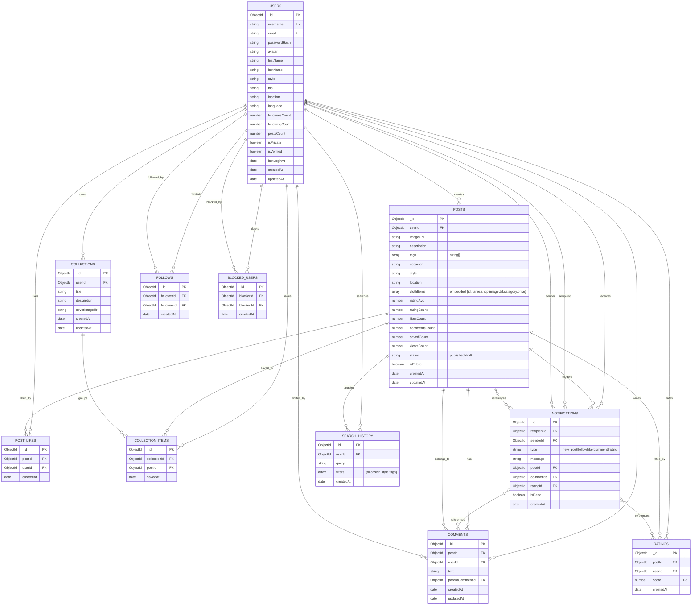

# Diseño de Base de Datos MongoDB - StyleBox

---

## Resumen de las colecciones

| Collection | Propósito | Índices Principales |
|-----------|-----------|---------------------|
| **users** | Perfil y preferencias | username (unique), email (unique) |
| **follows** | Relaciones follow | followerId+followeeId (unique), followeeId |
| **posts** | Publicaciones de outfits | userId+createdAt, tags, occasion, style, text-search |
| **ratings** | Valoraciones de posts | postId+userId (unique), postId |
| **post_likes** | Likes a posts | postId+userId (unique), postId |
| **comments** | Comentarios en posts | postId+createdAt, userId, parentCommentId |
| **collections** | Listas guardadas del usuario | userId, createdAt |
| **collection_items** | Posts dentro de colecciones | collectionId+postId (unique), collectionId |
| **notifications** | Alertas al usuario | recipientId+isRead+createdAt |
| **search_history** | Historial de búsquedas | userId+createdAt, query |
| **blocked_users** | Usuarios bloqueados | blockerId+blockedId (unique), blockerId, blockedId |

## Cardinalidades

- **User → Posts**: 1:N
- **User → Comments**: 1:N
- **User → Collections**: 1:N
- **User → Ratings**: 1:N
- **User → Search History**: 1:N
- **User ↔ User (follows)**: N:M vía FOLLOWS
- **User ↔ User (blocks)**: N:M vía BLOCKED_USERS
- **Post → Comments**: 1:N
- **Post → Ratings**: 1:N
- **Post ↔ User (likes)**: N:M vía POST_LIKES
- **Post ↔ Collections**: N:M vía COLLECTION_ITEMS
- **User ← Notifications**: 1:N (recibe)

## Optimizaciones

**Desnormalización**: likesCount, commentsCount, savedCount, ratingAvg, ratingCount, followersCount, followingCount, postsCount, viewsCount | **Embebidos**: clothItems dentro de posts | **Índices compuestos**: recipientId+isRead+createdAt, followerId+followeeId, blockerId+blockedId, postId+userId (likes/ratings), collectionId+postId
